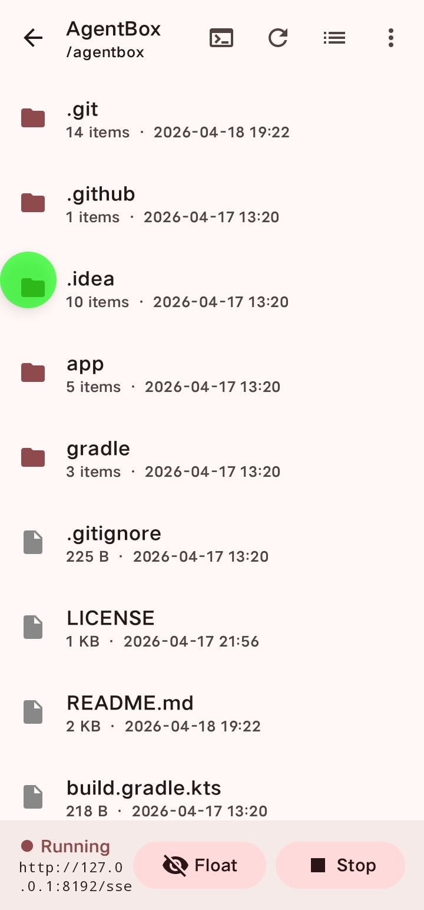
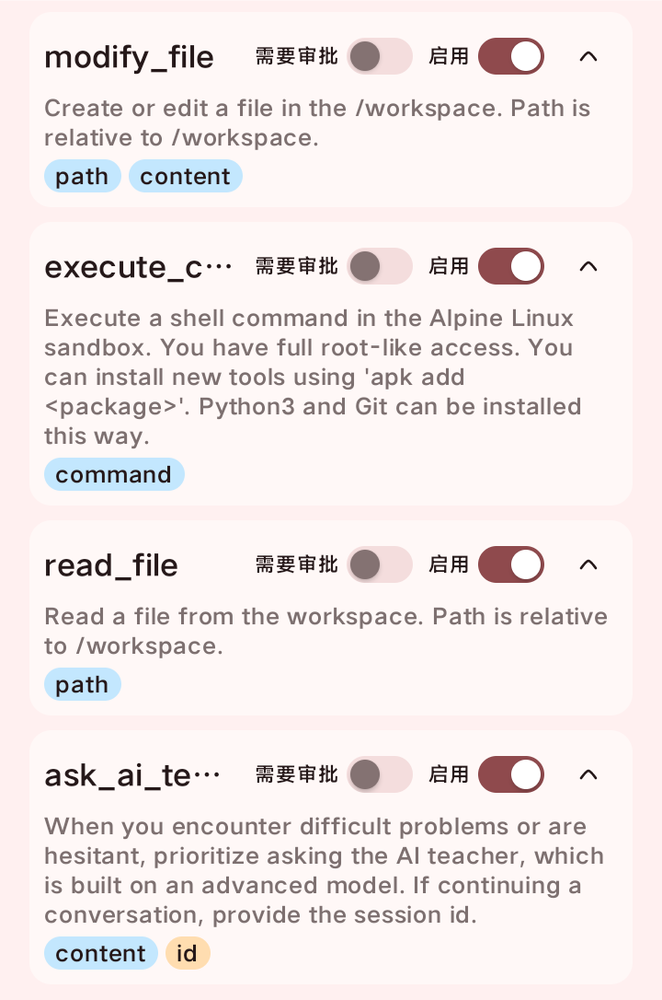
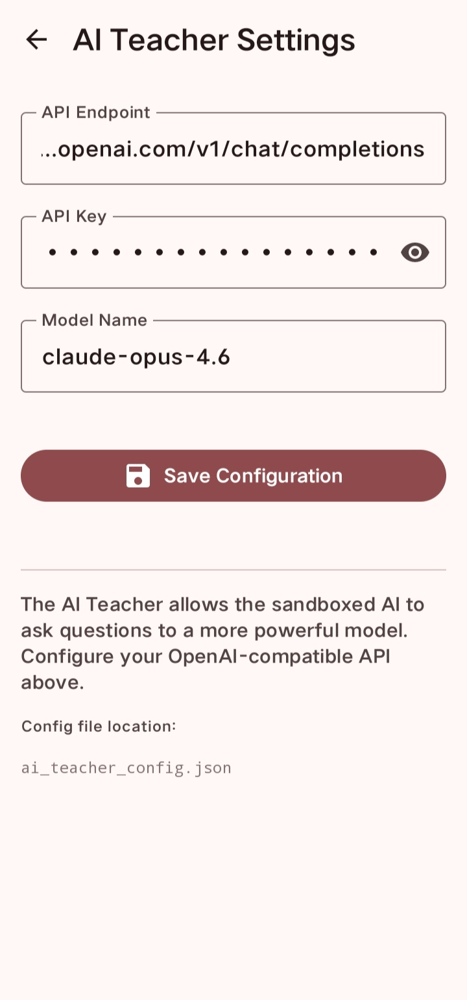
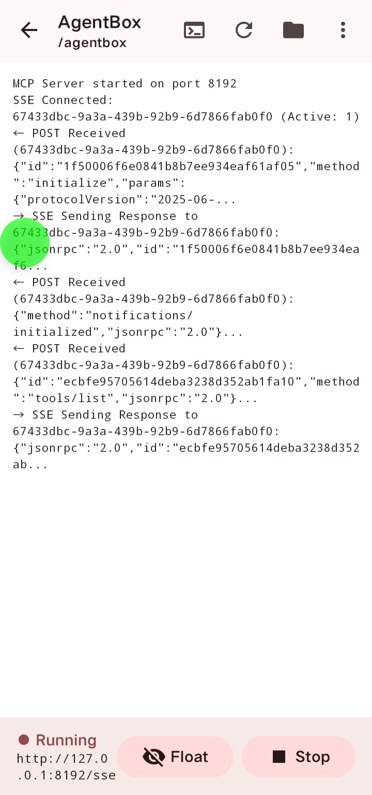
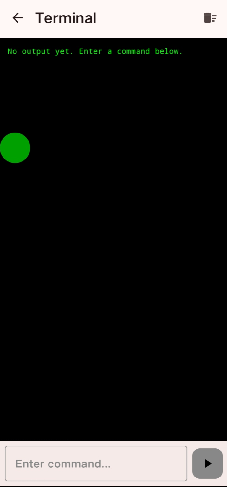

# AgentBox

AgentBox is an Android app that turns your phone into a sandboxed Linux workspace for AI agents.
It provides a built-in MCP server, a local terminal, file management, tool permission controls, and an optional **AI Teacher** that lets the sandboxed agent ask a stronger external model for help.

AgentBox is designed for scenarios where you want an AI to operate on-device with a controllable tool boundary, instead of giving it unrestricted access to your whole system.

## Screenshots

| Main Interface | MCP Client Connected | AI Teacher Config |
|:---:|:---:|:---:|
|  |  |  |

| Log Display | In-App Terminal |
|:---:|:---:|
|  |  |

## Features

- **Sandboxed Linux on Android**
  - Runs Alpine Linux inside a `proot` environment
  - No root required
  - Isolated workspace for agent operations

- **Built-in MCP Server**
  - Exposes tools over MCP using SSE transport
  - Easy to connect from external MCP-compatible clients
  - Includes request/response logs for debugging

- **Manual Terminal**
  - Execute commands directly inside the sandbox
  - Useful for testing the environment without an external MCP client

- **File Manager**
  - Browse files inside the workspace
  - Read and edit files through MCP tools
  - Convenient for verifying what the agent changed

- **AI Teacher**
  - A special tool: `ask_ai_teacher`
  - Lets the sandboxed agent ask a more powerful external model for help
  - Supports OpenAI-compatible APIs

- **Autonomous Multi-Agent Runtime**
  - Persistent shared board for orchestrator/worker collaboration
  - Internal worker agents can autonomously use command / read / modify tools in turns
  - Worker agents use a separately configured sub-agent model, so they do not consume the expensive AI Teacher config
  - Workers cannot call `ask_ai_teacher`; they must post questions/status to the board for the main AI to inspect

- **Floating Window Controls**
  - Keep the MCP service running in the background
  - Quick access to service state and controls

- **Backup / Import / Export**
  - Manage sandbox data more safely
  - Useful when migrating devices or testing environments

## Architecture

- **Platform**: Android
- **Language**: Kotlin
- **UI**: Jetpack Compose + Material 3
- **Sandbox**: Alpine Linux + `proot`
- **Protocol**: MCP over SSE, JSON-RPC messages

## Built-in Tools

AgentBox currently includes these core tools:

- `execute_command`
  - Execute a shell command in the Alpine Linux sandbox
- `read_file`
  - Read a file from `/workspace`
- `modify_file`
  - Create or edit a file in `/workspace`
- `ask_ai_teacher`
  - Ask an external stronger model for help through an OpenAI-compatible API
- `create_multi_agent_session`
  - Create a persistent multi-agent workspace for one user request
- `list_multi_agent_sessions`
  - List existing multi-agent workspaces
- `create_multi_agent_agent`
  - Create a worker agent with role and initial task
- `update_multi_agent_status`
  - Publish the latest worker progress, blockers, and handoff notes
- `get_multi_agent_board`
  - Read the shared board: workers plus recent timeline
- `coordinate_multi_agent`
  - Leave orchestrator feedback and optional task reassignment
- `start_multi_agent_runtime` / `pause_multi_agent_runtime` / `resume_multi_agent_runtime` / `stop_multi_agent_runtime`
  - Control the internal autonomous worker runtime for a session
- `get_multi_agent_runtime`
  - Inspect active runtime state

## AI Teacher

The AI Teacher is intended for cases where the local sandboxed agent gets stuck, hesitates, or needs stronger reasoning.

You can configure:
- API endpoint
- API key
- model name

Configuration is stored locally inside the app, and the tool can be called by the agent when enabled.

### Example call

#### Request

```json
{
  "content": "Hello! This is a test message. Calculate 2 + 2."
}
```

#### Response

```json
{
  "id": "116ed83a-334b-40b8-9a1c-5a345b6d5667",
  "reply": "Hello! Message received.\n\n2 + 2 = 4"
}
```

## Getting Started

### Requirements

- Android Studio Ladybug or newer
- JDK 17+
- Android device or emulator
- Android API 26+

### Build

1. Clone the repository.
2. Open the project in Android Studio.
3. Build and run the `app` module.

## Basic Usage

1. Open AgentBox.
2. Initialize or install the Linux environment if prompted.
3. Start the MCP service.
4. Connect your MCP client to the SSE endpoint shown by the app.
5. Use the floating controls if you want the service to keep running in the background.
6. Optionally open the built-in terminal to test commands directly.

## Connecting an MCP Client

After starting the MCP service, AgentBox displays a local SSE address similar to:

```text
http://127.0.0.1:8192/sse
```

Your MCP client can connect to this endpoint and then call the built-in tools.

> **Note:** For security reasons, the MCP server only accepts connections from **localhost (the device itself)**. Remote connections are not supported.

## Project Structure

```text
app/src/main/java/com/shaun/agentbox/
├── mcp/       # MCP models, service, tool execution, AI Teacher + Multi-Agent board
├── sandbox/   # Linux environment and workspace management
└── ui/        # Compose UI and floating window service
```


## Multi-Agent Notes

The multi-agent implementation now has two layers:

- **Board layer**: persistent sessions, workers, statuses, and supervisor notes
- **Runtime layer**: internal autonomous worker loops driven by a separately configured sub-agent model

Important separation:
- The **main/orchestrator AI** can still use `ask_ai_teacher`
- **Worker agents cannot call `ask_ai_teacher`**
- Worker agents instead write blockers and questions to the shared board for the main AI to inspect

This keeps the expensive teacher model separate from cheaper autonomous worker execution.

## Notes

- The sandbox is isolated, but tools can still be powerful. Be careful with `execute_command`.
- Tool switches and approval settings are recommended when connecting less trusted agents.
- The MCP server is intended for local use on the device unless you explicitly expose it yourself.

## License

MIT
